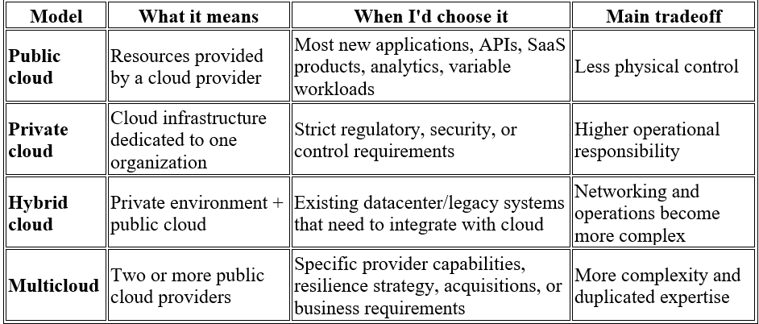

Private Cloud, Public Cloud, Hybrid Cloud & Multicloud
1. Explanation (made easy by writer)

Imagine you run a company that needs computers, storage, networking, and databases to run its applications.

You have four broad ways to organize that infrastructure.

Public cloud is like renting an apartment in a large building. A provider such as Microsoft Azure, Amazon Web Services, or Google Cloud owns and operates the building. You rent the resources you need and can scale them up or down without owning the physical infrastructure.

Private cloud is more like having your own building. The infrastructure is dedicated to one organization and can be operated by the organization itself or a third party. You get much more control over the environment, but you also take on more responsibility for managing it.

Hybrid cloud combines the two. You might keep sensitive or legacy workloads in your private environment while using public cloud resources for scalable workloads.

Multicloud means using two or more public cloud providers, for example Azure + AWS. The important distinction is that hybrid cloud is about combining different infrastructure environments, while multicloud is specifically about using multiple cloud providers.

So, in an interview, I'd summarize it like this:

Public cloud = someone else's infrastructure that I rent. Private cloud = infrastructure dedicated to my organization. Hybrid cloud = private + public environments working together. Multicloud = multiple cloud providers.

2. Contrast: when would I choose each?

The choice isn't simply "which cloud is best?"

I'd first look at the workload.

For example, if I'm building a new web application with unpredictable traffic, public cloud is usually the straightforward choice.

If an organization has an existing private environment containing systems that cannot easily move to the cloud, but wants public cloud scalability, hybrid makes more sense.

If a company deliberately runs workloads across Azure and AWS because of business or technical requirements, that's multicloud.

And I wouldn't choose multicloud just because it sounds more resilient. Running the same application across two clouds introduces networking, identity, deployment, monitoring, data synchronization, and operational complexity.

3. Why it matters in practice

This decision affects much more than where a server runs.

It affects:

Networking: VPNs, private connectivity, routing, DNS and firewalls.
Identity: How users, applications and services authenticate across environments.
Data: Where data lives, how it moves, and whether replication is required.
Security: Which environment controls access and security policies.
Cost: Data transfer and duplicated infrastructure can become significant.
Operations: Monitoring, logging, deployment and incident response become harder as environments increase.
Availability: Multiple environments can improve resilience, but only if the architecture actually handles failures.

A common misunderstanding is thinking:

"Hybrid cloud means I have servers somewhere and also use Azure."

Not necessarily. The important part is integration between the environments.

If the private environment and public cloud cannot communicate securely, share required identity information, or move the necessary data, you don't really have a useful hybrid architecture—you have two disconnected environments.

Similarly, using Azure and AWS does not automatically make a system resilient. If both clouds depend on the same database, DNS provider, or deployment pipeline, that dependency can still become a single point of failure.

4. Example scenario

Suppose I'm building an industrial monitoring system.

A factory already has machines and an on-premises/private environment containing operational data. Moving everything immediately to the public cloud isn't practical.

I could build this architecture:

Factory Machines
       |
       v
On-Prem / Private Environment
       |
       | Secure VPN / Private Connection
       v
Microsoft Azure
       |
       +--> IoT ingestion
       |
       +--> Data Lake
       |
       +--> Processing
       |
       +--> Database
       |
       +--> Monitoring Dashboard

A small hands-on version could be:

Run a simple telemetry generator locally that produces machine data.
Send the data through a secure connection to Azure.
Ingest it using Azure IoT Hub.
Store raw data in Azure Data Lake Storage Gen2.
Process the data using an Azure compute service.
Expose processed data through a dashboard.
Document which components are private/on-premises and which are public cloud.

That gives me an actual artifact demonstrating why hybrid architecture exists, rather than simply writing that "hybrid means private + public."

5. Interview angle
Q1. What's the difference between hybrid cloud and multicloud?

Model answer:

Hybrid cloud combines different infrastructure environments, typically private infrastructure and public cloud. Multicloud means using multiple cloud providers, such as Azure and AWS. They can overlap: an organization could have a private datacenter plus Azure and AWS, which would be both hybrid and multicloud.

Q2. Why wouldn't you automatically choose multicloud for high availability?

Model answer:

Because multiple clouds add significant operational complexity. I would need to consider cross-cloud networking, identity, deployment, monitoring, data replication and consistency. I'd only use multicloud when the resilience, regulatory, business, or technical requirements justify that complexity.

Q3. When would private cloud make more sense than public cloud?

Model answer:

When an organization has strong requirements around control, isolation, regulatory compliance, or existing infrastructure that makes public cloud unsuitable or impractical. But I'd also consider the operational cost, because private cloud means taking responsibility for much more of the infrastructure.

6. Terms to know
IaaS: Renting infrastructure such as virtual machines, storage and networking.
On-premises: Infrastructure physically operated within an organization's facilities.
VM: Virtual machine running an operating system on virtualized infrastructure.
VPC/VNet: Isolated virtual networking environment in a public cloud.
VPN: Encrypted connection between networks, commonly used in hybrid architectures.
Private connectivity: Dedicated/private network connectivity between environments.
Cloud bursting: Temporarily using public cloud capacity when private infrastructure reaches its limits.
Cloud migration: Moving workloads or data from one environment to another.
Vendor lock-in: Difficulty or cost involved in moving away from a cloud provider.
Data egress: Data transferred out of a cloud provider, which can incur charges.
Landing zone: A standardized, secured foundation for deploying workloads in a cloud environment.
Disaster recovery: Processes and infrastructure used to restore systems after major failures.