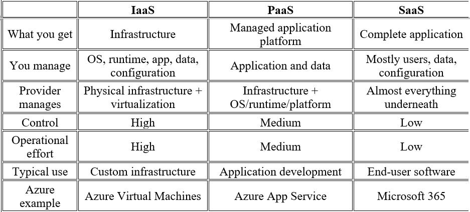
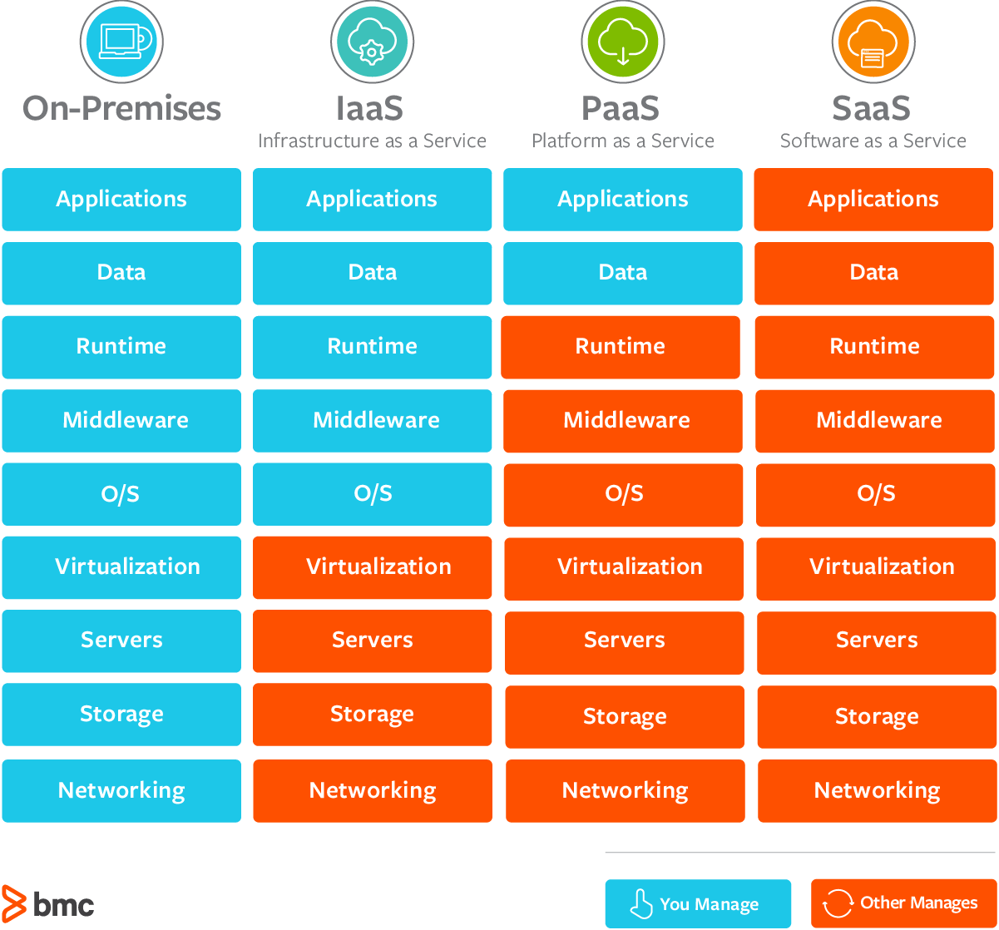

# IaaS vs PaaS vs SaaS and the Shared Responsibility Model

The easiest way to understand these models is to stop thinking about them as cloud terminology and think about who is responsible for what.

## 1. Plain English explanation

Imagine you want to open a restaurant.

With **IaaS**, you rent an empty restaurant building. You get the building, electricity, plumbing, and basic infrastructure, but you set up the kitchen, install the equipment, manage the ingredients, hire staff, and run the restaurant.

With **PaaS**, you rent a fully equipped commercial kitchen. The building, electricity, kitchen equipment, and much of the underlying infrastructure are already managed for you. You mainly bring your application and focus on running the business.

With **SaaS**, you simply order food from an existing restaurant. You don't manage the building, kitchen, equipment, or application. You just use the finished service.

That's essentially the difference:

- **IaaS** gives you infrastructure. 
- **PaaS** gives you a platform to build on. 
- **SaaS** gives you the finished software.

The more managed the service is, the less infrastructure you manage, but usually the less control you have.

This leads directly to the **Shared Responsibility Model**.

Moving to the cloud does not mean the cloud provider becomes responsible for everything. Responsibility is divided between you and the provider. The exact boundary depends on the service.

For example, with an Azure virtual machine, Microsoft manages the physical datacenter and virtualization infrastructure, while you still manage things such as the operating system, applications, configuration, and your data.

With a managed platform service, Microsoft takes responsibility for much more of the underlying stack.

## 2. IaaS vs PaaS vs SaaS Contrast



### When would I choose each?

**IaaS:**
I'd choose it when I need significant control over the operating system or infrastructure.
*Example: I need a specific OS configuration, custom networking, or software that isn't supported by a managed platform.*

**PaaS:**
I'd choose it for most typical web applications when I want to deploy code without spending time maintaining servers.
*Example: I have a Node.js API and want Azure to handle the servers, OS patching, scaling infrastructure, and platform.*

**SaaS:**
I'd choose it when I don't need to build the software at all.
*Example: Instead of building my own email or collaboration platform, I use Microsoft 365.*

<p align="center">
  
</p>

A useful way to remember the tradeoff is:

- **IaaS** → more control, more responsibility
- **PaaS** → less control, less responsibility
- **SaaS** → least control, least infrastructure responsibility

## 3. Why it matters in practice

This isn't just terminology. It affects security, deployment, maintenance, cost, reliability, and troubleshooting.

Suppose I deploy an application on an Azure VM and assume:

> "Azure manages my server."

That's only partially true.

Azure manages the underlying physical infrastructure, but I am still responsible for the guest operating system. If I don't patch it and it gets compromised, I can't simply blame the cloud provider.

Similarly, moving from a VM to Azure App Service changes the responsibility boundary. I no longer have to manage the underlying OS in the same way, allowing me to spend more time on the application itself.

Misunderstanding this model commonly causes problems such as:

- Unpatched operating systems
- Incorrect firewall/network configuration
- Exposed storage
- Weak identity and access controls
- Assuming backups are automatically configured
- Assuming the provider secures application code
- Not knowing who should troubleshoot a failure

The important mindset is:

> Cloud provider security does not automatically mean customer security.

The provider secures the parts of the cloud that they operate, while the customer remains responsible for the parts they control.

## 4. Example scenario

Imagine I'm building a small Node.js REST API for an e-commerce application.

### Option A — IaaS

# IaaS vs PaaS on Azure

## Option A — IaaS

I create an Azure Virtual Machine:

```text
Internet
   ↓
Azure VM
   ↓
Linux
   ↓
Node.js
   ↓
My API
   ↓
Database
```

## Option B — PaaS

Instead, I deploy the Node.js API to Azure App Service:

```text
Internet
   ↓
Azure App Service
   ↓
Node.js API
   ↓
Database
```

Now Azure handles much more of the underlying infrastructure, while I concentrate primarily on:

- Application code
- Configuration
- Identity/access
- Data

For a typical web API, I'd generally prefer PaaS unless I had a specific requirement for the additional control offered by IaaS.

## Hands-on artifact

A good portfolio exercise would be:

1. Create a small Node.js API.
2. Deploy it to Azure App Service.
3. Configure an environment variable.
4. Enable application logging.
5. Connect it to a managed database.
6. Document what you configured vs what Azure manages.
7. Explain why you chose PaaS instead of a VM.

That last part is important for a recruiter: it demonstrates that you understand architecture decisions, not just Azure commands.

## 5. Interview angle

**Q1. "What's the difference between IaaS and PaaS?"**

Model answer:
IaaS provides infrastructure such as virtual machines, networking, and storage, while I manage the OS and application stack. PaaS abstracts more of that infrastructure so I can focus primarily on deploying and operating my application. I choose PaaS when I don't need low-level OS control and want to reduce operational overhead.

**Q2. "If you're using Azure, is Azure responsible for security?"**

Model answer:
Security is shared. Azure is responsible for securing the underlying cloud infrastructure, while I remain responsible for things within my control, such as identities, access permissions, application security, data, and depending on the service, the operating system and network configuration.

**Q3. "Why wouldn't you always choose PaaS?"**

Model answer:
Because PaaS trades some control for convenience. If I need a custom operating system, specialized software, unusual networking, or low-level configuration that the platform doesn't support, I may need IaaS. The right choice depends on the application's requirements rather than simply choosing the most managed option.

## 6. Terms to know

- **Virtual Machine (VM):** A software-defined computer providing an IaaS environment.
- **Azure App Service:** Microsoft's managed PaaS for hosting web applications and APIs.
- **SaaS:** Finished software consumed as a service rather than built or managed by the customer.
- **Shared Responsibility Model:** Defines which security and operational responsibilities belong to the provider and customer.
- **Managed Service:** A cloud service where the provider operates more of the underlying infrastructure.
- **Serverless:** A highly managed execution model where infrastructure management is largely abstracted from the developer.
- **Scalability:** The ability of a system to handle increased workload by adding resources.
- **Identity and Access Management (IAM):** Controls who can access which cloud resources and what they can do.
- **Infrastructure as Code (IaC):** Defining infrastructure through code/configuration rather than manual setup.
- **Azure Resource Manager (ARM):** Azure's management layer for deploying and organizing resources.

## The one thing I'd remember for an interview

If I'm asked about IaaS, PaaS, SaaS, I wouldn't just recite definitions. I'd explain the responsibility boundary and the tradeoff:

The further I move from IaaS toward SaaS, the more the cloud provider manages for me. I gain operational simplicity but give up some control. The right choice depends on how much control my application actually requires.